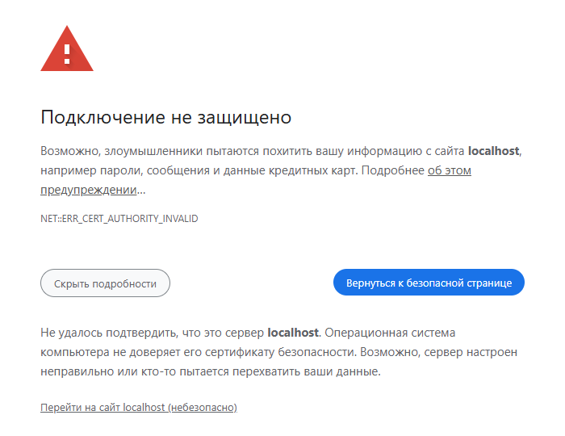
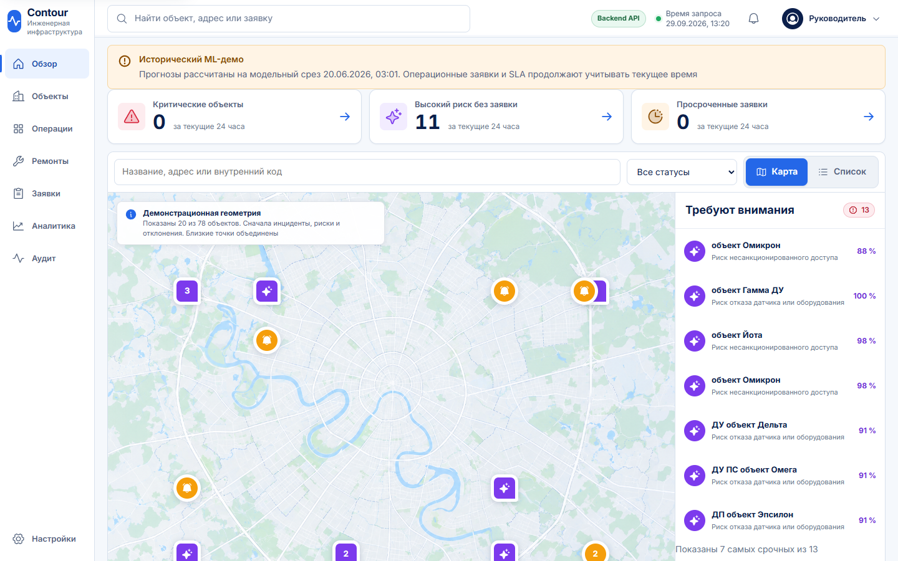
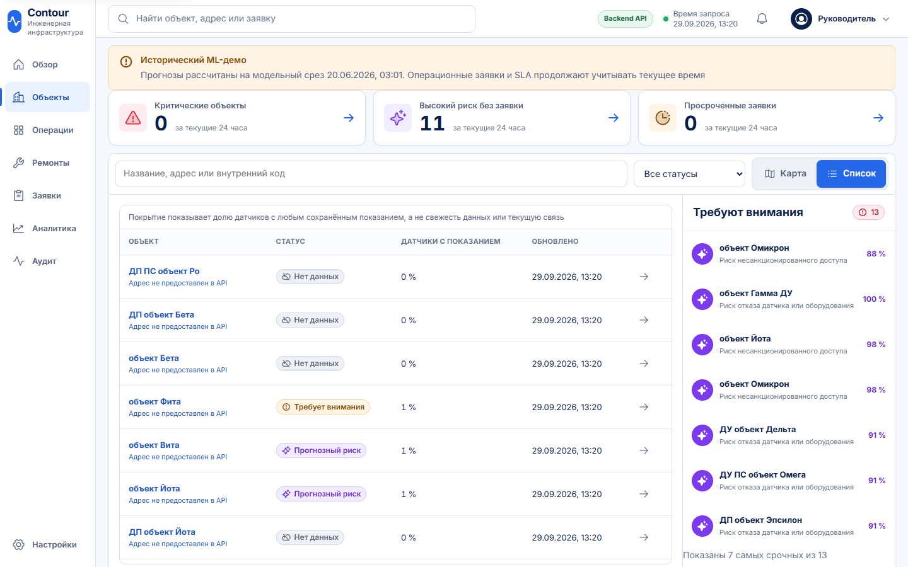
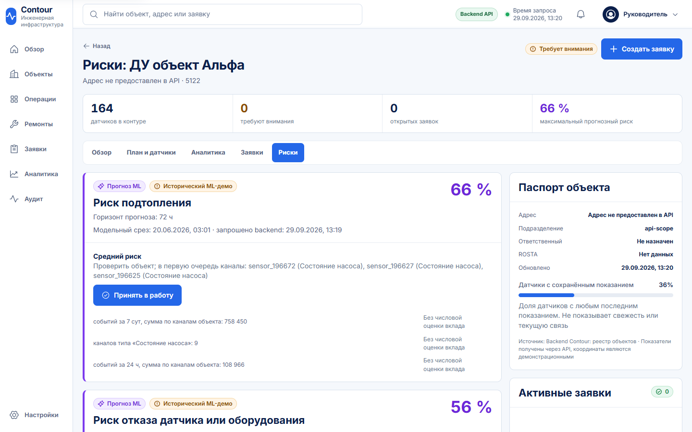
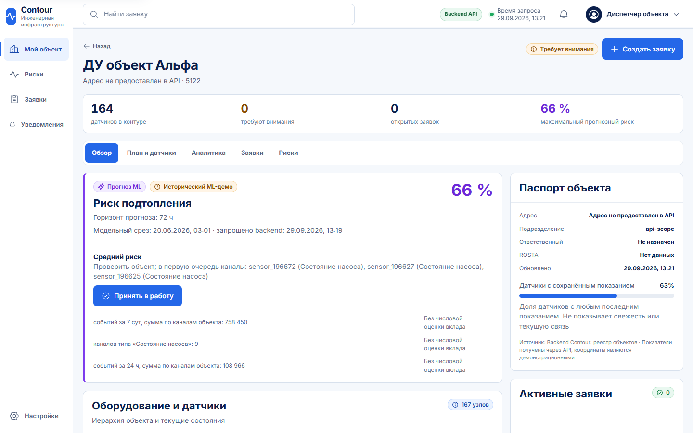
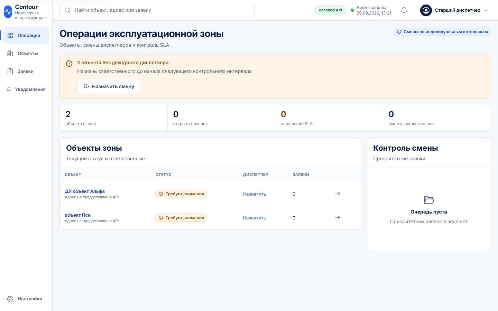
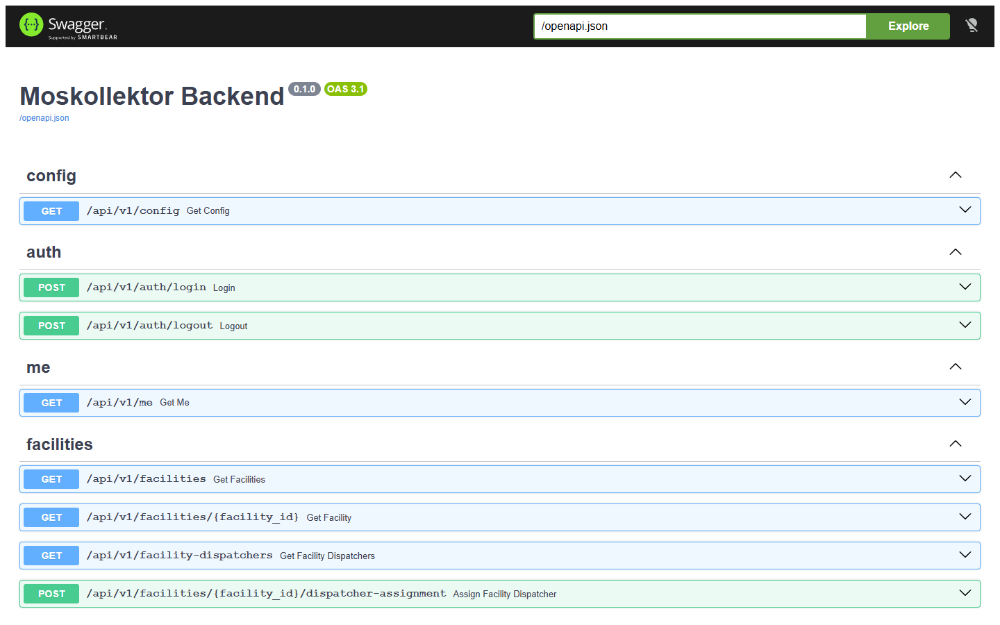

# Как запустить Contour с нуля

Пошаговая инструкция для проверки решения на своём компьютере. Все команды выполняются в PowerShell. Их можно копировать целиком

Весь продукт — интерфейс, сервер, база данных и ML-модели — запускается одной командой в Docker. После запуска система открывается в браузере по адресу **https://localhost:8443**

## Что понадобится

| Что | Зачем |
|---|---|
| Windows 10 или 11 | скрипты запуска написаны для PowerShell |
| [Docker Desktop](https://www.docker.com/products/docker-desktop/) | в нём работают все части системы |
| [Git](https://git-scm.com/download/win) | чтобы скачать репозиторий |
| данные для ML: zip-архив с готовыми файлами **или** восемь архивов организаторов `ext-journal-2019.7z` ... `ext-journal-2026.7z` | на них работают ML-модели |
| Python 3.12 (x64) | только если данные собираются из архивов организаторов |
| свободные порты `8080` и `8443` | через них открывается приложение |

Docker Desktop должен быть запущен: иконка кита в трее, статус «Engine running»

> Нужно посмотреть интерфейс, а архивов под рукой нет? Переходите сразу к разделу [«Быстрый просмотр без данных ML»](#быстрый-просмотр-без-данных-ml). Он запускается за несколько минут, но прогнозы в нём тестовые

## Шаг 1. Скачайте репозиторий

```powershell
git clone https://github.com/AEX-X/contour-lct-2026.git
cd contour-lct-2026
```

Все дальнейшие команды выполняются из этой папки

## Шаг 2. Разрешите запуск скриптов

Windows по умолчанию может запрещать запуск `.ps1`-скриптов. Разрешите их только для текущего окна PowerShell, системные настройки при этом не меняются:

```powershell
Set-ExecutionPolicy -Scope Process -ExecutionPolicy Bypass
```

Проверьте, что Docker отвечает:

```powershell
docker info
```

Если команда выдаёт ошибку, запустите Docker Desktop и дождитесь, пока он загрузится

## Шаг 3. Подготовьте данные для ML

ML-модели работают на журнале событий 2019–2026, подготовленном в восемь файлов `2019.parquet` ... `2026.parquet`. Выберите один из двух вариантов

### Вариант А. Есть архив с готовыми данными — быстро

Zip-архив с готовыми данными уже содержит нужные файлы, собирать ничего не нужно. Выполните команды, указав в `-LiteralPath` путь к архиву на своём компьютере. Папка `D:\contour-ml` — пример, подойдёт любая папка с путём латиницей и без пробелов:

```powershell
$ml = "D:\contour-ml"
Expand-Archive -LiteralPath "C:\путь\к\архиву.zip" -DestinationPath $ml
Get-ChildItem $ml -Recurse -Filter ml-prepared-service.tar | Move-Item -Destination $ml
tar -xf "$ml\ml-prepared-service.tar" -C $ml
.\scripts\check-ml-data.ps1 -MlDataDir "$ml\ml-prepared"
```

Что делают команды:

- распаковывают zip-архив, внутри него лежит файл `ml-prepared-service.tar`
- переносят этот файл в папку `D:\contour-ml`. Вложенную папку архива Windows показывает нечитаемыми символами, и из неё `tar` не может прочитать файл
- `tar` распаковывает папку `ml-prepared` с восемью файлами `.parquet`
- последняя команда проверяет, что все восемь файлов на месте и не повреждены

Если в конце появилась строка `ML-данные проверены: D:\contour-ml\ml-prepared`, данные готовы. Копировать их в репозиторий не нужно: путь к ним передаётся при запуске в шаге 4

### Вариант Б. Есть только архивы организаторов — долго

Из восьми архивов `ext-journal-20xx.7z` журнал собирается одной командой. Укажите папку, где лежат архивы:

```powershell
.\scripts\prepare-ml-data.ps1 -SourceDir "D:\путь\к\архивам"
```

Что делает скрипт:

- проверяет, что архивы те самые: сверяет размер и контрольную сумму
- по очереди распаковывает и обрабатывает каждый год
- складывает восемь готовых файлов `2019.parquet` ... `2026.parquet` в папку `ml-data`

Для первого запуска нужен интернет: скрипт ставит две библиотеки Python. Обработка занимает заметное время, оно зависит от компьютера. Если прервать скрипт, его можно запустить снова: готовые годы будут пропущены

В конце появится строка:

```text
ML-данные готовы. Теперь запусти .\scripts\start-full.ps1
```

Если архивы защищены паролем, задайте его перед запуском только для текущего окна:

```powershell
$env:CONTOUR_DATASET_PASSWORD="пароль"
```

## Шаг 4. Запустите систему

Если данные готовили по варианту А, укажите путь к ним:

```powershell
.\scripts\start-full.ps1 -MlDataDir "D:\contour-ml\ml-prepared"
```

Если по варианту Б, данные уже лежат в папке `ml-data` репозитория, путь не нужен:

```powershell
.\scripts\start-full.ps1
```

Скрипт сам:

1. проверяет данные ML
2. собирает и запускает четыре контейнера: интерфейс со шлюзом, сервер, база данных, ML-сервис
3. ждёт, пока все они будут готовы
4. проверяет, что вход, данные и прогнозы реальных моделей работают, в том числе при 20 одновременных пользователях

Первая сборка занимает несколько минут. Запуск успешен, когда в конце видны строки:

```text
Contour готов: https://localhost:8443
Режим прогнозов: реальные ML-модели
```

Если хоть одна проверка не прошла, скрипт остановится с сообщением об ошибке. Ненастоящими прогнозами он проблему не подменяет

## Шаг 5. Откройте приложение

Откройте в браузере **https://localhost:8443**

Сервер использует собственный сертификат, выпущенный при первом запуске на этом компьютере, поэтому браузер предупредит о небезопасном подключении. Это ожидаемо для локального стенда. Нажмите **«Дополнительные настройки»**, затем **«Перейти на сайт localhost (небезопасно)»**:



## Шаг 6. Войдите

На экране входа есть кнопки демонстрационных ролей: нажмите на роль, и логин с паролем подставятся сами. Затем нажмите **«Войти»**


| Роль | Логин | Пароль | Что увидит |
|---|---|---|---|
| Руководитель | `manager` | `manager123` | весь город: карта, объекты, аналитика, аудит |
| Старший диспетчер | `senior_dispatcher` | `senior123` | несколько закреплённых объектов, смены диспетчеров |
| Диспетчер объекта | `dispatcher` | `dispatcher123` | один объект: риски, заявки, уведомления |
| Координатор | `coordinator` | `coordinator123` | очередь ремонтов и назначение инженеров |
| Инженер | `engineer` | `engineer123` | свои заявки и доступ к объекту на время работ |

Каждая роль видит только свои объекты и действия: это проверяет сервер, а не только интерфейс

## Что посмотреть

> Скриншоты ниже сделаны в полном режиме с реальными ML-моделями. Жёлтая плашка «Исторический ML-демо» означает, что модели считают прогноз на исторических данных журнала 2019–2026: в поле «Модельный срез» видно, на какой момент. Сроки заявок и SLA при этом считаются от текущего времени

**Обзор города** (руководитель). Карта объектов с цветом состояния и список того, что требует внимания в первую очередь: инциденты, высокие риски, просроченные заявки



**Объекты** (руководитель, вкладка «Список»). Все объекты со статусом и долей датчиков, от которых есть показания



**Риски объекта.** Прогнозы ML по объекту: тип риска, вероятность, горизонт прогноза, рекомендация с конкретными каналами, которые стоит проверить, и признаки, на которых основан прогноз. Из карточки прогноз можно принять в работу или создать по нему заявку



**Рабочее место диспетчера объекта** (`dispatcher`). Сразу после входа он видит свой объект: главный прогноз, паспорт объекта, оборудование и датчики. В меню только его объект, риски, заявки и уведомления, чужих объектов он не видит



**Операции старшего диспетчера** (`senior_dispatcher`). Объекты зоны, дежурные диспетчеры, открытые заявки и нарушения сроков



**Документация API** — **https://localhost:8443/docs**. Полный список методов сервера. Их можно вызвать прямо со страницы



## Быстрый просмотр без данных ML

Если архивов нет, а интерфейс посмотреть нужно, выполните шаги 1 и 2, затем:

```powershell
.\scripts\start-lite.ps1
```

Данные ML не нужны, запуск занимает несколько минут. Вместо обученных моделей работает заглушка `StubPredictor` с тестовыми прогнозами: скрипт прямо предупреждает об этом при запуске. Адрес и вход те же, что в шагах 5 и 6. Этот режим показывает интерфейс и работу системы, но не качество прогнозов

Быстрый и полный режимы используют разные базы данных, поэтому тестовые прогнозы в полный режим не попадают

## Остановить и начать заново

Остановить, сохранив данные:

```powershell
.\scripts\stop.ps1
```

Удалить базу данных и сертификат, чтобы следующий запуск был «с чистого листа». Подготовленные файлы ML при этом остаются:

```powershell
.\scripts\reset.ps1 -Force
```

## Если что-то пошло не так

| Что видно | Что сделать |
|---|---|
| `Невозможно загрузить файл ... так как выполнение сценариев отключено в этой системе` | выполнить шаг 2 в текущем окне PowerShell |
| `docker info` выдаёт ошибку | запустить Docker Desktop и дождаться статуса «Engine running» |
| `Python 3.12 не найден` | установить Python 3.12 x64 с [python.org](https://www.python.org/downloads/) и открыть новое окно PowerShell |
| `start-full.ps1` пишет, что нет файла `20xx.parquet` | выполнить шаг 3; при варианте А указать `-MlDataDir` с путём к папке `ml-prepared` |
| `tar.exe: Error opening archive` | сначала перенести `ml-prepared-service.tar` командой `Move-Item` из шага 3, вариант А |
| ошибка о занятом порте `8080` или `8443` | закрыть программу, которая занимает порт, или остановить другой запуск Contour командой `.\scripts\stop.ps1` |
| `Стек запущен, но smoke-test не пройден` | посмотреть журналы командой, которую скрипт выводит выше строкой `Диагностика: ...` |
| браузер не открывает страницу | подождать минуту после строки «Contour готов» и обновить страницу |

Подробности об устройстве системы — в [README](../README.md), об ограничениях демо-версии — в [LIMITATIONS.md](LIMITATIONS.md)
